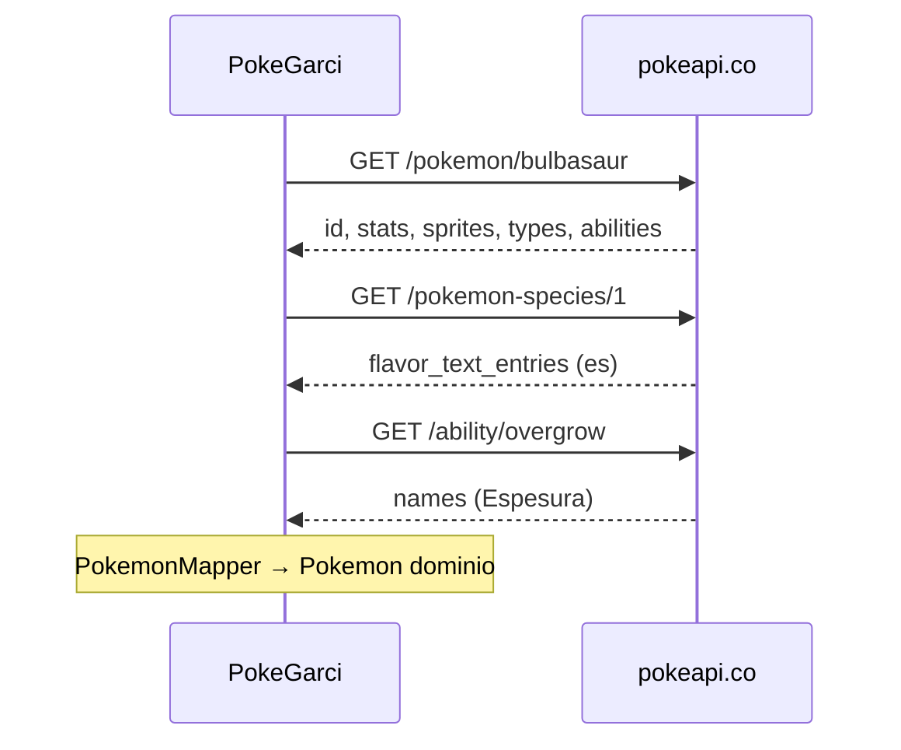

# PokeAPI — Guía de referencia para PokeGarci

> **Ubicación canónica:** `docs/POKEAPI.md`  
> **Documentación oficial:** https://pokeapi.co/docs/v2  
> **Base URL del proyecto:** `https://pokeapi.co/api/v2/` (`NetworkModule.kt`)

Este archivo recopila lo necesario para integrar y ampliar PokeGarci sin depender de la web en cada sesión. La API oficial es mucho más amplia; aquí se prioriza lo que el proyecto usa hoy y lo más útil para extensiones futuras.

---

## 1. Resumen de la API

| Aspecto | Valor |
|--------|--------|
| Versión | **v2** (v1 obsoleta) |
| Métodos HTTP | Solo **GET** |
| Autenticación | Ninguna |
| Formato | JSON |
| Rate limiting | Sin límite estricto desde 2018; se pide **cache local** y uso razonable |
| Identificación de recurso | `{id}` numérico o `{name}` en kebab-case (`special-attack`, `mr-mime`) |

### Política de uso justo (resumen)

- Cachear respuestas en el dispositivo (Room + OkHttp cache en PokeGarci).
- No hacer scraping masivo ni ataques de denegación de servicio.
- Uso educativo / personal; la API es gratuita y muy solicitada.

### Paginación de listas

`GET /api/v2/{endpoint}/` sin ID devuelve una página de recursos:

| Parámetro | Descripción |
|-----------|-------------|
| `limit` | Tamaño de página (por defecto **20**) |
| `offset` | Desplazamiento para la siguiente página |

Respuesta típica (`NamedAPIResourceList`) — ver también [§10.1](#101-lista-pokemon).

**Nota PokeGarci:** `PokeApiService.getPokemonList` solo envía `limit` (sin `offset`). Con `POKEMON_LIMIT = 251` se obtienen los **251 primeros** Pokémon de la lista global (Kanto + Johto en orden nacional).

---

## 2. Integración actual en PokeGarci

### Arquitectura de red

```
PokeApiService (Retrofit)
    → PokemonRemoteDataSource
    → PokemonMapper
    → PokemonRepositoryImpl (+ Room)
```

| Archivo | Rol |
|---------|-----|
| `data/.../di/NetworkModule.kt` | Retrofit, OkHttp cache 10 MB, `BASE_URL` |
| `data/.../remote/PokeApiService.kt` | Contrato Retrofit |
| `data/.../remote/dto/PokeApiDtos.kt` | DTOs Gson (subconjunto de campos) |
| `data/.../remote/PokemonRemoteDataSource.kt` | Orquestación y paralelismo |
| `data/.../mapper/PokemonMapper.kt` | DTO → dominio + i18n |
| `app/.../util/AppConstants.kt` | `POKEMON_LIMIT = 251` |

### Endpoints usados

| Método Retrofit | HTTP | Uso en app |
|-----------------|------|------------|
| `getPokemonList(limit)` | `GET pokemon?limit={n}` | Lista inicial de nombres/URLs |
| `getPokemonDetails(name)` | `GET pokemon/{name}` | Stats, tipos, sprite, altura/peso, habilidades |
| `getPokemonSpecies(id)` | `GET pokemon-species/{id}` | `flavor_text_entries` (descripción) |
| `getAbilityDetails(name)` | `GET ability/{name}` | `names[]` localizados de la 1ª habilidad |

### Flujo de carga (por Pokémon)

Para cada entrada de la lista se ejecutan **hasta 3 peticiones** en paralelo (`coroutineScope` + `async`):

1. `pokemon/{name}` — datos de combate y sprite  
2. `pokemon-species/{id}` — texto flavor por idioma  
3. `ability/{firstAbility}` — nombre traducido de la habilidad  

Al cambiar idioma sin recargar todo: `refreshLocalizedContent` vuelve a pedir **species + ability** por Pokémon en caché.

**Impacto:** 251 Pokémon × 3 ≈ **753** peticiones en la primera carga completa (más la lista). Room y OkHttp cache mitigan recargas.

### Campos mapeados al dominio (`Pokemon`)

| Dominio | Origen API |
|---------|------------|
| `id`, `name` | `pokemon.id`, `pokemon.name` (nombre capitalizado en mapper) |
| `imageUrl` | `sprites.front_default` |
| `type1`, `type2` | `types[0]`, `types[1]` → `type.name` |
| `hp` … `speed` | `stats[]` → claves `hp`, `attack`, `defense`, `special-attack`, `special-defense`, `speed` |
| `height`, `weight` | `pokemon.height`, `pokemon.weight` (ver unidades abajo) |
| `description` | `species.flavor_text_entries` filtrado por idioma |
| `firstAbility` | Primera entrada de `abilities[]` + `ability.names` |

### DTOs Gson (campos parseados)

Solo se deserializan los campos declarados en `PokeApiDtos.kt`; el resto del JSON se ignora.

- `PokemonListResponse` → `results[]`  
- `PokemonDetailsResponse` → `id`, `name`, `sprites`, `types`, `stats`, `height`, `weight`, `abilities`  
- `SpeciesResponse` → `flavor_text_entries`  
- `AbilityResponse` → `names`  

ProGuard: `data/consumer-rules.pro` mantiene `PokeApiService` y DTOs.

---

## 3. Recursos clave (detalle para PokeGarci)

### 3.1 `GET /pokemon/{id|name}`

Recurso principal de un Pokémon concreto (forma por defecto o variante en la URL).

**Campos relevantes no usados aún pero útiles:**

| Campo | Descripción |
|-------|-------------|
| `base_experience` | EXP base |
| `species` | Enlace a `pokemon-species` (mismo id suele coincidir) |
| `sprites.other.official-artwork.front_default` | Arte oficial HD |
| `sprites.other.home.front_default` | Sprite estilo HOME |
| `moves[]` | Movimientos por versión |
| `abilities[].is_hidden` | Habilidad oculta |
| `location_area_encounters` | URL relativa a encuentros salvajes |

**Sprites** (`sprites`):

- `front_default`, `front_shiny`, variantes `*_female`  
- `other.official-artwork`, `other.home`, `other.dream-world`, `other.showdown`  
- `versions.generation-*` — sprites retro por juego  

PokeGarci usa solo `front_default`.

**Stats** (`stats[]`): ver ejemplo en [§10.2](#102-pokemon-detalles).

Nombres de stat en API (usar exactamente en mapper):

- `hp`, `attack`, `defense`, `special-attack`, `special-defense`, `speed`

**Tipos** (`types[]`):

- `slot`: 1 = primario, 2 = secundario  
- `type.name`: `fire`, `water`, … (minúsculas, inglés)

**Habilidades** (`abilities[]`):

- Ordenadas por `slot` (1, 2, 3); la 3 suele ser oculta  
- `ability.name`: identificador API (`overgrow`, `chlorophyll`)  
- PokeGarci toma **solo la primera** del array

**Unidades (importante):**

| Campo | Unidad API | Conversión habitual en UI |
|-------|------------|---------------------------|
| `height` | **decímetros** (dm) | ÷ 10 → metros |
| `weight` | **hectogramos** (hg) | ÷ 10 → kg |

### 3.2 `GET /pokemon-species/{id|name}`

Atributos compartidos por la especie (todas las formas).

**PokeGarci usa:** `flavor_text_entries[]` — ejemplos en [§10.3](#103-pokemon-species).

**Idiomas:** filtrar por `language.name` igual al código de app (`es`, `en` desde `LocaleManager`).

**Quirks de texto (oficial):**

- Puede haber **varias entradas** por idioma (una por versión de juego). PokeGarci usa `firstOrNull { language == X }` → la primera que devuelva la API, no necesariamente la más reciente.  
- Caracteres especiales: `\n`, `\f` (form feed). El mapper los sustituye por espacio.  
- A veces el texto viene con encoding raro en entradas antiguas.

**Otros campos útiles para futuras features:**

| Campo | Uso posible |
|-------|-------------|
| `names[]` | Nombre localizado del Pokémon (no usado; hoy se usa `pokemon.name` en inglés capitalizado) |
| `genera[]` | Categoría (“Seed Pokémon” / “Semilla”) |
| `color`, `shape` | Filtros Pokédex |
| `evolution_chain.url` | Árbol evolutivo |
| `is_legendary`, `is_mythical` | Badges |
| `varieties[]` | Formas alternativas (Alola, Gigamax, etc.) |

### 3.3 `GET /ability/{id|name}`

**PokeGarci usa:** `names[]` con `language.name` + `name` (nombre mostrado).

También disponibles: `effect_entries`, `flavor_text_entries`, `pokemon[]` con `is_hidden`.

**Convención de nombre:** minúsculas y guiones (`friend-guard`). El data source pasa `.lowercase()` al path.

### 3.4 `GET /pokemon?limit=&offset=`

Lista paginada. Sin `offset`, empieza en el Pokémon #1 (Bulbasaur) en orden de la API.

Para **ampliar más allá de 251**:

- Subir `POKEMON_LIMIT` o paginar con `offset`  
- Considerar `generation` / `pokedex/{name}` para cargar por región en lugar de los N primeros nacionales

---

## 4. Idiomas (i18n)

PokeAPI identifica idiomas con `language.name` (ISO 639-1 en la mayoría de casos).

| App (`LocaleManager`) | PokeAPI `language.name` | Notas |
|----------------------|-------------------------|--------|
| `es` | `es` | Descripciones y nombres de habilidad |
| `en` | `en` | Fallback implícito si falta entrada |

Otros códigos frecuentes en la API: `ja`, `fr`, `de`, `it`, `ko`, `zh-Hans`, `zh-Hant`, `ja-Hrkt`, etc.

**Nombre del Pokémon:** actualmente se muestra el `name` del endpoint `pokemon` (inglés API, capitalizado). Para nombre español usar `pokemon-species.names` filtrado por idioma.

---

## 5. Catálogo de endpoints v2 (referencia rápida)

Solo **GET**. `{id|name}` salvo donde se indica solo `{id}`.

### Listas y utilidad

| Endpoint | Nombre en lista |
|----------|-----------------|
| `/ability/` | named |
| `/berry/`, `/berry-firmness/`, `/berry-flavor/` | named |
| `/characteristic/` | **unnamed** (solo id) |
| `/contest-type/`, `/contest-effect/`, `/super-contest-effect/` | mixed |
| `/encounter-method/`, `/encounter-condition/`, `/encounter-condition-value/` | named |
| `/evolution-chain/` | **unnamed** |
| `/evolution-trigger/` | named |
| `/generation/`, `/pokedex/`, `/version/`, `/version-group/` | named |
| `/item/`, `/item-attribute/`, `/item-category/`, `/item-fling-effect/`, `/item-pocket/` | named |
| `/location/`, `/location-area/`, `/pal-park-area/`, `/region/` | named |
| `/machine/` | **unnamed** |
| `/move/` + sub-recursos (`move-ailment`, `move-category`, …) | named |
| `/pokemon/`, `/pokemon-species/`, `/pokemon-form/`, `/pokemon-color/`, `/pokemon-shape/`, `/pokemon-habitat/` | named |
| `/pokemon/{id}/encounters` | encuentros por área |
| `/stat/`, `/type/` | named |
| `/language/` | named |
| `/egg-group/`, `/gender/`, `/growth-rate/`, `/nature/`, `/pokeathlon-stat/` | named |

### Grupos temáticos (para explorar features)

- **Pokémon:** `pokemon`, `pokemon-species`, `pokemon-form`, encounters  
- **Combate:** `move`, `type`, `ability`, `stat`  
- **Mundo:** `location`, `location-area`, `region`, `generation`  
- **Objetos:** `item`, categorías, `machine` (TMs)  
- **Evolución:** `evolution-chain`, `evolution-trigger`  

Documentación completa con esquemas JSON: https://pokeapi.co/docs/v2

---

## 6. Modelos comunes reutilizables

| Tipo | Campos | Uso |
|------|--------|-----|
| `NamedAPIResource` | `name`, `url` | Referencias en casi todos los JSON |
| `APIResource` | `url` | Sin nombre (evolution-chain, etc.) |
| `Name` | `name`, `language` | Nombres localizados |
| `FlavorText` | `flavor_text`, `language`, `version` | Descripciones Pokédex |
| `VerboseEffect` | `effect`, `short_effect`, `language` | Efectos de habilidades/movimientos |

---

## 7. Límites, rendimiento y buenas prácticas en Android

### Ya implementado en PokeGarci

- **Room** — caché persistente de Pokémon procesados  
- **OkHttp Cache** — 10 MB en `cacheDir/http_cache`  
- **Carga paralela** — `async` por Pokémon  
- **`runCatching`** — un fallo no tumba toda la lista  

### Recomendaciones al ampliar

1. **Ampliar DTOs solo cuando haga falta** — Gson ignora campos extra; añadir campos evita refactors si luego se usan.  
2. **Paginación o carga por generación** — evitar miles de peticiones en un solo arranque.  
3. **Sprites alternativos** — URLs en `raw.githubusercontent.com/PokeAPI/sprites`; no pasan por `pokeapi.co` pero son estables.  
4. **Filtrar flavor text por `version`** — si se quiere el texto de un juego concreto (p. ej. último `version.name`).  
5. **Respetar `networking.md`** — DTOs no salen de `data`; dominio en `domain`.  
6. **Probar offline** — `PokemonRepositoryImpl` ya prioriza caché Room antes que red.

### Cálculo aproximado de peticiones

```
1 + (limit × 3)   // primera carga completa con el patrón actual
```

Ejemplo: `limit = 251` → ~754 peticiones HTTP.

---

## 8. Extensiones sugeridas (no implementadas)

| Feature | Endpoint / campo |
|---------|------------------|
| Nombre ES del Pokémon | `pokemon-species.names` |
| Arte oficial | `sprites.other["official-artwork"].front_default` |
| Shiny | `sprites.front_shiny` |
| Segunda habilidad / oculta | `abilities[1]`, `is_hidden` |
| Cadena evolutiva | `evolution-chain/{id}` |
| Filtrar por generación | `generation/{id}` → `pokemon_species[]` |
| Pokédex regional | `pokedex/{name}` → `pokemon_entries` |
| Tipos y debilidades | `type/{name}` → `damage_relations` |
| Movimientos | `pokemon.moves` (JSON muy grande) |

---

## 9. Ejemplos HTTP útiles

```http
GET https://pokeapi.co/api/v2/pokemon?limit=20&offset=0
GET https://pokeapi.co/api/v2/pokemon/pikachu
GET https://pokeapi.co/api/v2/pokemon-species/25
GET https://pokeapi.co/api/v2/ability/static
GET https://pokeapi.co/api/v2/type/electric
GET https://pokeapi.co/api/v2/generation/2
```

---

## 10. Ejemplos JSON

Respuestas obtenidas de `pokeapi.co` (junio 2026). Los bloques **PokeGarci** muestran solo lo que parsean los DTOs actuales; los bloques **Completo (recortado)** incluyen campos útiles para extensiones, con partes enormes omitidas (`/* ... */`).

### 10.1 Lista `pokemon`

`GET https://pokeapi.co/api/v2/pokemon?limit=3`

```json
{
  "count": 1350,
  "next": "https://pokeapi.co/api/v2/pokemon?offset=3&limit=3",
  "previous": null,
  "results": [
    { "name": "bulbasaur", "url": "https://pokeapi.co/api/v2/pokemon/1/" },
    { "name": "ivysaur", "url": "https://pokeapi.co/api/v2/pokemon/2/" },
    { "name": "venusaur", "url": "https://pokeapi.co/api/v2/pokemon/3/" }
  ]
}
```

**PokeGarci** (`PokemonListResponse`): solo deserializa `results`. Ignora `count`, `next`, `previous` (no hay paginación con `offset` hoy).

Con `GET pokemon?limit=251` se reciben los 251 primeros `results`; el `count` total sigue siendo ~1350.

---

### 10.2 Pokemon detalles

`GET https://pokeapi.co/api/v2/pokemon/bulbasaur`

#### Vista PokeGarci (campos en `PokeApiDtos.kt`)

Equivalente a lo que Gson rellena en `PokemonDetailsResponse`:

```json
{
  "id": 1,
  "name": "bulbasaur",
  "height": 7,
  "weight": 69,
  "sprites": {
    "front_default": "https://raw.githubusercontent.com/PokeAPI/sprites/master/sprites/pokemon/1.png"
  },
  "types": [
    { "slot": 1, "type": { "name": "grass", "url": "https://pokeapi.co/api/v2/type/12/" } },
    { "slot": 2, "type": { "name": "poison", "url": "https://pokeapi.co/api/v2/type/4/" } }
  ],
  "stats": [
    { "base_stat": 45, "stat": { "name": "hp", "url": "https://pokeapi.co/api/v2/stat/1/" } },
    { "base_stat": 49, "stat": { "name": "attack", "url": "https://pokeapi.co/api/v2/stat/2/" } },
    { "base_stat": 49, "stat": { "name": "defense", "url": "https://pokeapi.co/api/v2/stat/3/" } },
    { "base_stat": 65, "stat": { "name": "special-attack", "url": "https://pokeapi.co/api/v2/stat/4/" } },
    { "base_stat": 65, "stat": { "name": "special-defense", "url": "https://pokeapi.co/api/v2/stat/5/" } },
    { "base_stat": 45, "stat": { "name": "speed", "url": "https://pokeapi.co/api/v2/stat/6/" } }
  ],
  "abilities": [
    {
      "ability": { "name": "overgrow", "url": "https://pokeapi.co/api/v2/ability/65/" },
      "is_hidden": false,
      "slot": 1
    },
    {
      "ability": { "name": "chlorophyll", "url": "https://pokeapi.co/api/v2/ability/34/" },
      "is_hidden": true,
      "slot": 3
    }
  ]
}
```

**Mapper:** `height` 7 → 0,7 m; `weight` 69 → 6,9 kg. `type2` = `null` si solo hay un tipo. Primera habilidad → petición a `ability/overgrow`.

#### Completo (recortado)

El JSON real pesa ~250 KB (cientos de `moves` y árbol de `sprites.versions`). Estructura adicional relevante:

```json
{
  "id": 1,
  "name": "bulbasaur",
  "base_experience": 64,
  "height": 7,
  "weight": 69,
  "is_default": true,
  "order": 1,
  "species": {
    "name": "bulbasaur",
    "url": "https://pokeapi.co/api/v2/pokemon-species/1/"
  },
  "sprites": {
    "front_default": "https://raw.githubusercontent.com/PokeAPI/sprites/master/sprites/pokemon/1.png",
    "front_shiny": "https://raw.githubusercontent.com/PokeAPI/sprites/master/sprites/pokemon/shiny/1.png",
    "other": {
      "official-artwork": {
        "front_default": "https://raw.githubusercontent.com/PokeAPI/sprites/master/sprites/pokemon/other/official-artwork/1.png"
      },
      "home": {
        "front_default": "https://raw.githubusercontent.com/PokeAPI/sprites/master/sprites/pokemon/other/home/1.png"
      }
    }
    /* versions.generation-i … generation-ix: docenas de URLs más */
  },
  "moves": [
    {
      "move": { "name": "razor-wind", "url": "https://pokeapi.co/api/v2/move/13/" },
      "version_group_details": [ /* nivel, método, versión */ ]
    }
    /* ~100 movimientos más */
  ],
  "location_area_encounters": "https://pokeapi.co/api/v2/pokemon/1/encounters"
}
```

---

### 10.3 `pokemon-species`

`GET https://pokeapi.co/api/v2/pokemon-species/1`

#### Vista PokeGarci (`SpeciesResponse`)

```json
{
  "flavor_text_entries": [
    {
      "flavor_text": "A strange seed was\nplanted on its\nback at birth.\fThe plant sprouts\nand grows with\nthis POKéMON.",
      "language": { "name": "en", "url": "https://pokeapi.co/api/v2/language/9/" },
      "version": { "name": "red", "url": "https://pokeapi.co/api/v2/version/1/" }
    },
    {
      "flavor_text": "Este Pokémon nace con una semilla en la espalda, que brota con el paso del tiempo.",
      "language": { "name": "es", "url": "https://pokeapi.co/api/v2/language/7/" },
      "version": { "name": "sword", "url": "https://pokeapi.co/api/v2/version/33/" }
    }
    /* decenas de entradas más por idioma y versión de juego */
  ]
}
```

**Mapper:** `firstOrNull { language.name == "es" }` → descripción en español; sustituye `\n` y `\f` por espacios.

#### Completo (recortado)

```json
{
  "id": 1,
  "name": "bulbasaur",
  "order": 1,
  "gender_rate": 1,
  "capture_rate": 45,
  "base_happiness": 70,
  "is_baby": false,
  "is_legendary": false,
  "is_mythical": false,
  "hatch_counter": 20,
  "color": { "name": "green", "url": "https://pokeapi.co/api/v2/pokemon-color/5/" },
  "generation": { "name": "generation-i", "url": "https://pokeapi.co/api/v2/generation/1/" },
  "evolves_from_species": null,
  "evolution_chain": { "url": "https://pokeapi.co/api/v2/evolution-chain/1/" },
  "names": [
    { "name": "Bulbasaur", "language": { "name": "en", "url": "https://pokeapi.co/api/v2/language/9/" } },
    { "name": "Bulbasaur", "language": { "name": "es", "url": "https://pokeapi.co/api/v2/language/7/" } },
    { "name": "フシギダネ", "language": { "name": "ja", "url": "https://pokeapi.co/api/v2/language/11/" } }
  ],
  "genera": [
    { "genus": "Seed Pokémon", "language": { "name": "en", "url": "https://pokeapi.co/api/v2/language/9/" } },
    { "genus": "Pokémon Semilla", "language": { "name": "es", "url": "https://pokeapi.co/api/v2/language/7/" } }
  ],
  "flavor_text_entries": [ /* ver arriba */ ],
  "varieties": [
    {
      "is_default": true,
      "pokemon": { "name": "bulbasaur", "url": "https://pokeapi.co/api/v2/pokemon/1/" }
    }
  ]
}
```

---

### 10.4 `ability`

`GET https://pokeapi.co/api/v2/ability/overgrow`

#### Vista PokeGarci (`AbilityResponse`)

```json
{
  "names": [
    { "name": "Overgrow", "language": { "name": "en", "url": "https://pokeapi.co/api/v2/language/9/" } },
    { "name": "Espesura", "language": { "name": "es", "url": "https://pokeapi.co/api/v2/language/7/" } },
    { "name": "Engrais", "language": { "name": "fr", "url": "https://pokeapi.co/api/v2/language/5/" } }
  ]
}
```

**Mapper:** con idioma `es` → `displayName` = `"Espesura"`. Path en red: `ability/overgrow` (minúsculas).

#### Completo (recortado)

```json
{
  "id": 65,
  "name": "overgrow",
  "is_main_series": true,
  "generation": { "name": "generation-iii", "url": "https://pokeapi.co/api/v2/generation/3/" },
  "names": [
    { "name": "Overgrow", "language": { "name": "en", "url": "https://pokeapi.co/api/v2/language/9/" } },
    { "name": "Espesura", "language": { "name": "es", "url": "https://pokeapi.co/api/v2/language/7/" } }
  ],
  "effect_entries": [
    {
      "effect": "When this Pokémon has 1/3 or less of its HP remaining, its Grass-type moves inflict 1.5× as much regular damage.",
      "short_effect": "Strengthens Grass moves to inflict 1.5× damage at 1/3 max HP or less.",
      "language": { "name": "en", "url": "https://pokeapi.co/api/v2/language/9/" }
    }
  ],
  "flavor_text_entries": [
    {
      "flavor_text": "Potencia los movimientos de tipo Planta del Pokémon cuando le quedan pocos PS.",
      "language": { "name": "es", "url": "https://pokeapi.co/api/v2/language/7/" },
      "version_group": { "name": "sun-moon", "url": "https://pokeapi.co/api/v2/version-group/17/" }
    }
  ],
  "pokemon": [
    { "is_hidden": false, "slot": 1, "pokemon": { "name": "bulbasaur", "url": "https://pokeapi.co/api/v2/pokemon/1/" } }
    /* muchas especies más con esta habilidad */
  ]
}
```

---

### 10.5 Extensiones futuras (muestras)

#### `type` — debilidades

`GET https://pokeapi.co/api/v2/type/grass`

```json
{
  "id": 12,
  "name": "grass",
  "damage_relations": {
    "double_damage_from": [
      { "name": "flying", "url": "https://pokeapi.co/api/v2/type/3/" },
      { "name": "poison", "url": "https://pokeapi.co/api/v2/type/4/" },
      { "name": "bug", "url": "https://pokeapi.co/api/v2/type/7/" },
      { "name": "fire", "url": "https://pokeapi.co/api/v2/type/10/" },
      { "name": "ice", "url": "https://pokeapi.co/api/v2/type/15/" }
    ],
    "double_damage_to": [
      { "name": "ground", "url": "https://pokeapi.co/api/v2/type/5/" },
      { "name": "rock", "url": "https://pokeapi.co/api/v2/type/6/" },
      { "name": "water", "url": "https://pokeapi.co/api/v2/type/11/" }
    ],
    "half_damage_from": [
      { "name": "ground", "url": "https://pokeapi.co/api/v2/type/5/" },
      { "name": "water", "url": "https://pokeapi.co/api/v2/type/11/" },
      { "name": "grass", "url": "https://pokeapi.co/api/v2/type/12/" },
      { "name": "electric", "url": "https://pokeapi.co/api/v2/type/13/" }
    ],
    "no_damage_to": [
      { "name": "flying", "url": "https://pokeapi.co/api/v2/type/3/" }
    ]
  }
}
```

#### `evolution-chain` — línea evolutiva

`GET https://pokeapi.co/api/v2/evolution-chain/1` (Bulbasaur → Ivysaur → Venusaur)

```json
{
  "id": 1,
  "baby_trigger_item": null,
  "chain": {
    "is_baby": false,
    "species": { "name": "bulbasaur", "url": "https://pokeapi.co/api/v2/pokemon-species/1/" },
    "evolves_to": [
      {
        "is_baby": false,
        "species": { "name": "ivysaur", "url": "https://pokeapi.co/api/v2/pokemon-species/2/" },
        "evolution_details": [
          {
            "min_level": 16,
            "trigger": { "name": "level-up", "url": "https://pokeapi.co/api/v2/evolution-trigger/1/" }
          }
        ],
        "evolves_to": [
          {
            "is_baby": false,
            "species": { "name": "venusaur", "url": "https://pokeapi.co/api/v2/pokemon-species/3/" },
            "evolution_details": [
              {
                "min_level": 32,
                "trigger": { "name": "level-up", "url": "https://pokeapi.co/api/v2/evolution-trigger/1/" }
              }
            ],
            "evolves_to": []
          }
        ]
      }
    ]
  }
}
```

#### `generation` — filtrar por región

`GET https://pokeapi.co/api/v2/generation/2` (Johto, recorte)

```json
{
  "id": 2,
  "name": "generation-ii",
  "pokemon_species": [
    { "name": "chikorita", "url": "https://pokeapi.co/api/v2/pokemon-species/152/" },
    { "name": "bayleef", "url": "https://pokeapi.co/api/v2/pokemon-species/153/" },
    { "name": "meganium", "url": "https://pokeapi.co/api/v2/pokemon-species/154/" }
    /* … hasta celebi */
  ]
}
```

---

### 10.6 Flujo completo (Bulbasaur, idioma `es`)

Secuencia que ejecuta `PokemonRemoteDataSource.fetchPokemon("bulbasaur", "es")`:



**Salida conceptual en dominio** (no es JSON de la API):

```json
{
  "id": 1,
  "name": "Bulbasaur",
  "imageUrl": "https://raw.githubusercontent.com/PokeAPI/sprites/master/sprites/pokemon/1.png",
  "type1": "grass",
  "type2": "poison",
  "description": "Este Pokémon nace con una semilla en la espalda, que brota con el paso del tiempo.",
  "hp": 45,
  "attack": 49,
  "defense": 49,
  "specialAttack": 65,
  "specialDefense": 65,
  "speed": 45,
  "height": 7,
  "weight": 69,
  "firstAbility": {
    "originalName": "overgrow",
    "displayName": "Espesura"
  }
}
```

---

### 10.7 Tabla rápida JSON → DTO → dominio

| JSON (endpoint) | Campo JSON | DTO Kotlin | Campo `Pokemon` |
|-----------------|------------|------------|-----------------|
| `pokemon` | `id` | `PokemonDetailsResponse.id` | `id` |
| `pokemon` | `name` | `name` | `name` (capitalizado) |
| `pokemon` | `sprites.front_default` | `SpriteResponse.front_default` | `imageUrl` |
| `pokemon` | `types[].type.name` | `TypeSlot` | `type1`, `type2` |
| `pokemon` | `stats[].stat.name` + `base_stat` | `Stats` | `hp`, `attack`, … |
| `pokemon` | `height`, `weight` | directo | `height`, `weight` |
| `pokemon` | `abilities[0].ability.name` | `AbilityBasicDetails` | `firstAbility.originalName` |
| `pokemon-species` | `flavor_text_entries` | `FlavorTextEntry` | `description` |
| `ability` | `names[].name` (por idioma) | `AbilityName` | `firstAbility.displayName` |

---

## 11. Enlaces externos

| Recurso | URL |
|---------|-----|
| Docs v2 | https://pokeapi.co/docs/v2 |
| Sitio | https://pokeapi.co |
| Sprites (repo) | https://github.com/PokeAPI/sprites |
| GraphQL (alternativa) | https://pokeapi.co/graphql |
| Fair use / FAQ | https://pokeapi.co/docs/v2#information |

---

## 12. Changelog de este documento

| Fecha | Cambio |
|-------|--------|
| 2026-06-04 | Creación inicial alineada con `PokeApiService`, DTOs y `POKEMON_LIMIT=251` |
| 2026-06-04 | Sección 10: ejemplos JSON (lista, pokemon, species, ability, type, evolution-chain, flujo dominio) |

*Si cambias endpoints o DTOs en código, actualiza este archivo en el mismo PR.*
